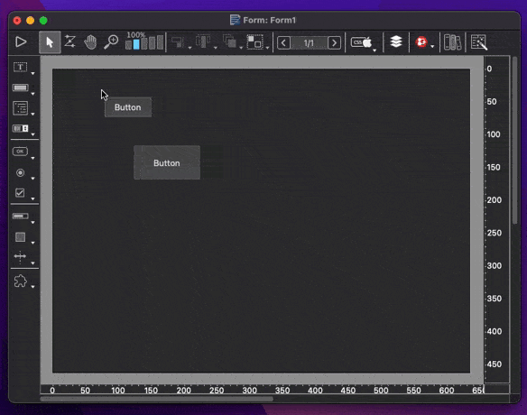
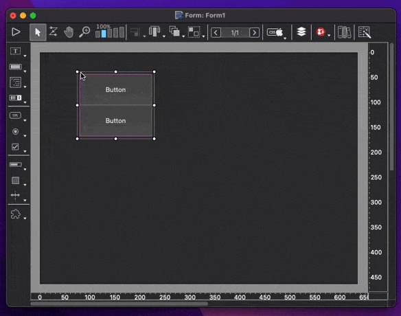

# StackView

[![language][code-shield]][code-url]
[![language-top][code-top]][code-url]
![code-size][code-size]
[![license][license-shield]][license-url]
[![discord][discord-shield]][discord-url]

 Stack layout experimentation with form objects inpired by [UIStackView](https://developer.apple.com/documentation/uikit/uistackview)


## In form editor

Create a rectangle or maybe a groupbox for the stack background , then group it with some form objects.

> Rectangle must be under other objects so first in group

## In code

Init the stack and keep it somewhere (`Form`, class instance in `Form`, ...)

```4d
	Form.stack:=cs.Stack.new("Rectangle"; "Button"; "Input"; "Text"; "Button2")
```
> The first element must be the rectangle

then in `On Load` and `On Resize` call `perform` to move objects according to wanted options

```4d
	Form.stack.perform(New object("spacing"; 20; "axis"; "vertical")) // could be horizontal
 ```

## Form macros

to help there is some macros

### stack: create

select some elements then launch the macro, it will create for you the group and the transparent background rectangle



### stack: align vertically & horizontally

you could in form macro menu apply horizontal or vertical stack alignment to the selected group



#### stack: set spacing

Before applying alignment you could register the spacing.

> this will register custom json key in Form in first element of group, the rectangle

### stack: generate new code

It generate the code to init a `cs.Stack` with all selected group children elements and the perform with registered parameters.

## TODO

- [ ] some inner padding conf variable
- [ ] other distributions than `fill` one, for instance align the objects to the left instead of taking the full width

## Other components

[](https://mesopelagique.github.io/)

<!-- MARKDOWN LINKS & IMAGES -->
<!-- https://www.markdownguide.org/basic-syntax/#reference-style-links -->
[code-shield]: https://img.shields.io/static/v1?label=language&message=4d&color=blue
[code-top]: https://img.shields.io/github/languages/top/mesopelagique/StackView.svg
[code-size]: https://img.shields.io/github/languages/code-size/mesopelagique/StackView.svg
[code-url]: https://developer.4d.com/
[license-shield]: https://img.shields.io/github/license/mesopelagique/StackView
[license-url]: LICENSE
[discord-shield]: https://img.shields.io/badge/chat-discord-7289DA?logo=discord&style=flat
[discord-url]: https://discord.gg/dVTqZHr
