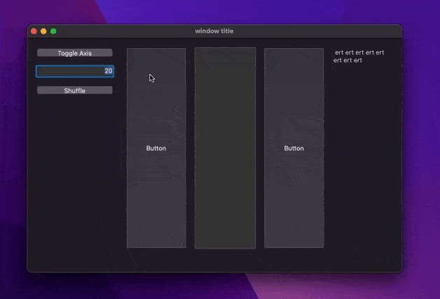

# StackView

 Stack layout experimentation with form objects



## In form editor

Create a rectangle for the stack, then group it with some form objects.

> Rectangle must be under other objects and first in group

## In code

Init the stack and keep it somewhere

```4d
	This.stack:=cs.Stack.new("Rectangle"; "Button"; "Input"; "Text"; "Button2")
```
> The first element must be the rectangle

then in `On Load` and `On Resize` call `perform` to move objects according to wanted options

```4d
	This.stack.perform(New object("spacing"; 20; "axis"; "vertical")) // could be horizontal
 ```

## Form macros

to help there is two macros

### Apply stack alignment to selected group

you could in macro menu apply horizontal or vertical stack alignment 

unfortunately you could not select a `spacing` like that

### Generate code

it generate the code to init a `cs.Stack` with all selected group elements.
